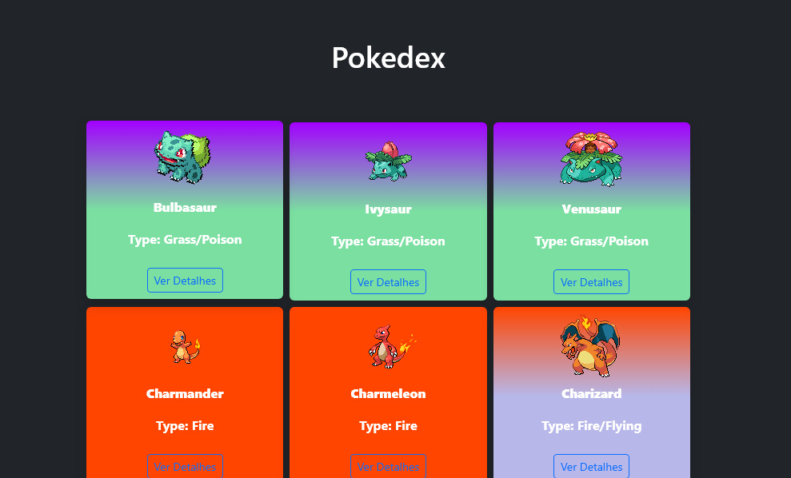

# 🧠 React Pokédex

Uma Pokédex construída com **React + Vite**, consumindo dados da [PokéAPI](https://pokeapi.co/). O projeto foi criado para treinar:

- Consumo de APIs
- Componentização
- Hooks (`useState`, `useEffect`, `useRef`)
- Estilização com **Bootstrap**
- Manipulação de modais
- Scroll automático com referência (`ref`)
- Animações com CSS

---

## 📸 Preview



---

## 🚀 Funcionalidades

- 🔍 Carregamento dos Pokémons em blocos de 20 em 20
- 🎨 Cards com background e cor baseada no tipo do Pokémon
- 🧭 Scroll automático para o botão após carregar
- 📦 Modais com detalhes (em construção)
- 🌀 Animação de "Carregando..." com CSS

---

## 🛠️ Tecnologias Usadas

- [React](https://react.dev/)
- [Vite](https://vitejs.dev/)
- [Bootstrap 5](https://getbootstrap.com/)
- [PokéAPI](https://pokeapi.co/)
- CSS puro (sem styled-components ainda)

---

## 📁 Como Rodar Localmente

```bash
# Clone o repositório
git clone https://github.com/seu-usuario/react-pokedex.git

# Acesse a pasta
cd react-pokedex

# Instale as dependências
npm install

# Rode o projeto
npm run dev
🔧 Melhorias Futuras

🔍 Campo de busca por nome

🌙 Tema escuro (dark mode)

📱 Design responsivo melhorado

❤️ Marcar favoritos

👨‍💻 Autor
 Marcus Lins.
